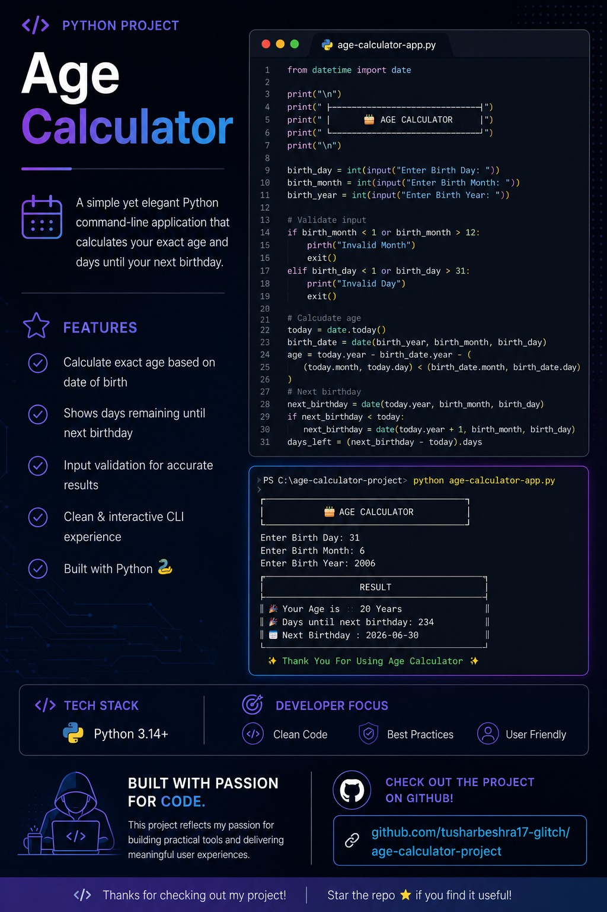

# 🐍 Python Quiz Game

A beginner-friendly Python Quiz Game that tests Python programming knowledge through multiple difficulty levels, randomized questions, high score tracking, and a replay option. 🎯🚀

## ✨ Features

✅ Three Difficulty Levels (Easy, Medium, Hard)
✅ Randomized Questions Every Game 🔀
✅ High Score Tracking 🏆
✅ Play Again Option 🔁
✅ Simple Terminal-Based Interface 💻
✅ Instant Score Display 📊
✅ Beginner-Friendly Code 📚

## 🛠️ Technologies Used

🐍 Python

🎲 random Module

⚙️ Functions

📋 Lists

🔁 Loops

🧩 Match-Case

## 📸 Screenshot



## 🚀 How to Run

1️⃣ Download or clone the repository
2️⃣ Open the project folder
3️⃣ Run the Python file

```bash
python age_calculator.py
```

## 👨‍💻 Author

🚀 Tushar
